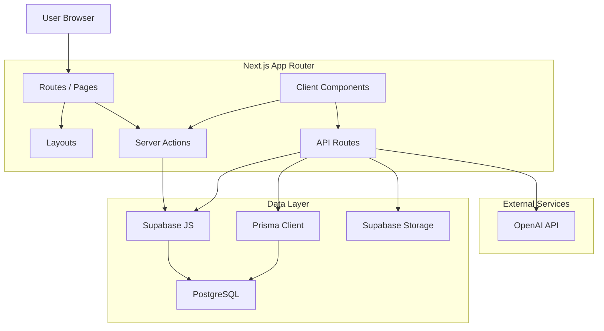
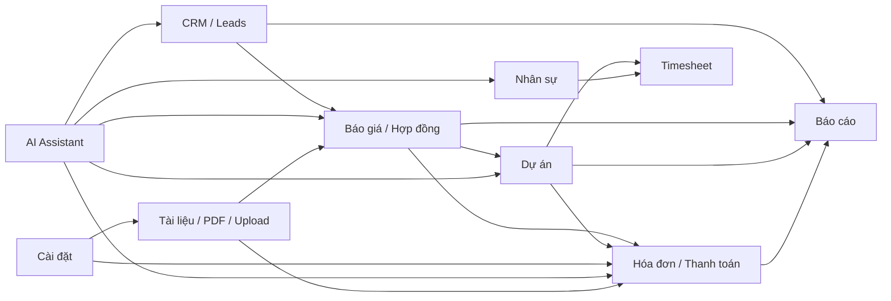
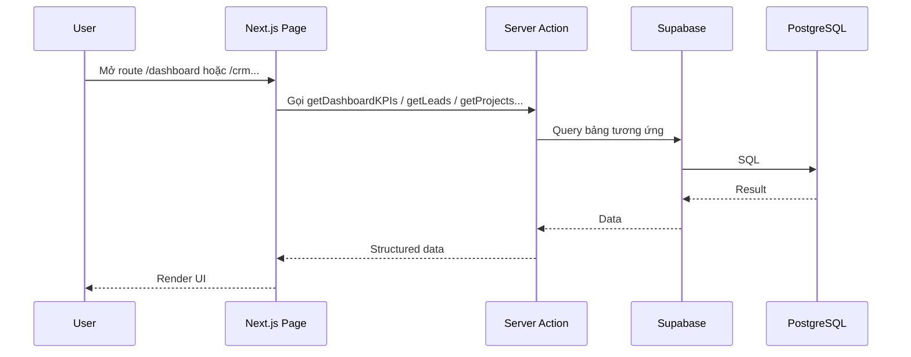
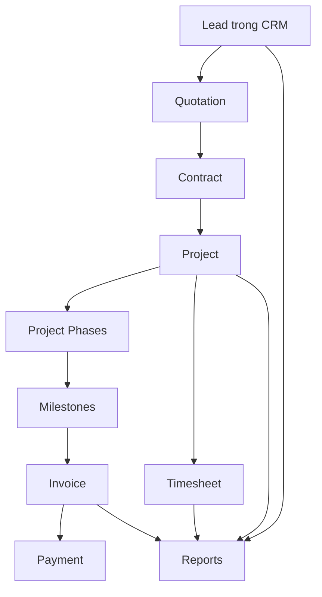
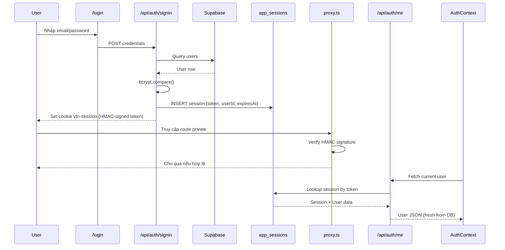
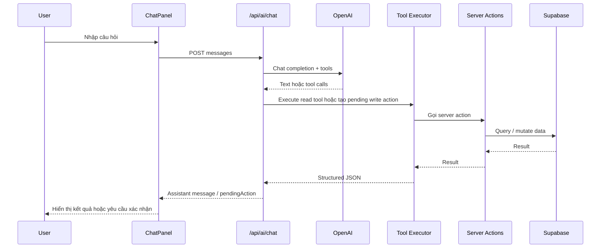
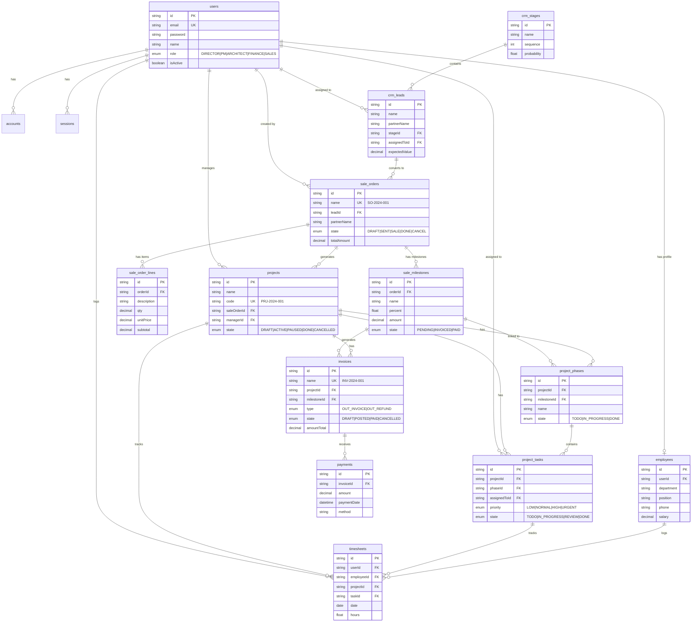

# VTN ERP

Onboarding note / x-ray report cho dự án ERP nội bộ của **VTN Architects / Công ty TNHH Võ Trọng Nghĩa**.

Tài liệu này được viết lại từ **code đang chạy trong repo**, không dựa vào README mặc định cũ. Mục tiêu là giúp người mới vào dự án hiểu nhanh:

- Dự án đang giải quyết bài toán gì
- Kiến trúc kỹ thuật hiện tại đang vận hành ra sao
- Các module chính nối với nhau như thế nào
- Auth flow và AI flow đang chạy theo cơ chế nào
- Những khoản technical debt ưu tiên cần xử lý

## 1. Tổng Quan

### Mục đích sản phẩm

Đây là hệ thống ERP nội bộ cho một công ty kiến trúc, phục vụ chuỗi nghiệp vụ:

`Lead -> Báo giá -> Hợp đồng -> Dự án -> Hóa đơn -> Thanh toán -> Timesheet`

Các module hiện diện trong code:

- `Dashboard`
- `CRM & Leads`
- `Báo giá & Hợp đồng`
- `Dự án`
- `Hóa đơn`
- `Nhân sự`
- `Timesheet`
- `Báo cáo`
- `Cài đặt`
- `AI Assistant`
- `Upload tài liệu`
- `Xuất PDF`

### Mục tiêu nghiệp vụ

Hệ thống đang được thiết kế để thay thế các thao tác rời rạc bằng một luồng quản lý thống nhất:

1. Sales hoặc PM tạo và theo dõi lead trong CRM.
2. Lead đủ điều kiện được chuyển thành báo giá.
3. Báo giá có thể được duyệt và chuyển thành hợp đồng.
4. Hợp đồng được chuyển thành dự án, milestone và phase.
5. Milestone sinh hóa đơn.
6. Finance ghi nhận thanh toán.
7. Team log timesheet theo dự án.
8. Ban điều hành theo dõi KPI, doanh thu, pipeline, utilization.

## 2. Công Nghệ Sử Dụng

| Layer | Công nghệ | Version |
|---|---|---|
| Framework | Next.js App Router | 16.1.6 |
| UI | React | 19.2.3 |
| Ngôn ngữ | TypeScript | ^5 |
| Data access chính | Supabase JS | ^2.98.0 |
| ORM/modeling | Prisma Client | ^7.4.2 |
| Database | PostgreSQL | (hosted Supabase) |
| Auth runtime | Server-side sessions (Odoo-style) → `app_sessions` table | — |

| UI primitives | Radix UI | avatar, dialog, select, tabs, tooltip, ... |
| Charts | Recharts | ^3.7.0 |
| PDF | `@react-pdf/renderer` | ^4.3.2 |
| AI SDK | OpenAI Chat Completions + tool calling | ^6.27.0 |
| Styling | Tailwind CSS 4 + global CSS | ^4 |
| Icons | Lucide React | ^0.577.0 |
| Date utilities | date-fns | ^4.1.0 |

## 3. Khởi Động Nhanh

### Yêu cầu

- Node.js 18+
- npm
- Supabase project có schema tương ứng
- OpenAI API key nếu muốn dùng AI assistant

### Cài đặt

```bash
npm install
copy .env.example .env
npm run dev
```

Mở [http://localhost:3000](http://localhost:3000).

### Biến môi trường

Tối thiểu cần:

```env
DATABASE_URL=postgresql://...
AUTH_SECRET=...               # HMAC-SHA256 key for session cookie signing

NEXT_PUBLIC_SUPABASE_URL=https://...
NEXT_PUBLIC_SUPABASE_ANON_KEY=...
OPENAI_API_KEY=sk-...
```

Ghi chú:

- `Supabase` đang là data access chính của phần lớn server actions.
- `Prisma` vẫn tồn tại và dùng direct Postgres connection.
- Nếu thiếu `OPENAI_API_KEY`, module chat AI sẽ trả lỗi cấu hình.

## 4. Bức Tranh Kiến Trúc

### Kiểu kiến trúc

Dự án hiện tại là một **modular monolith** chạy trên Next.js:

- App Router tổ chức route theo module nghiệp vụ
- Page server-side gọi `server actions`
- Client components xử lý form, modal, toast, drag-drop
- Data chủ yếu đi qua `Supabase JS client`
- Auth bảo vệ bằng server-side session (HMAC-signed cookie → DB lookup)

### Sơ đồ tổng thể



### Kiến trúc dữ liệu thực tế

Có 2 lớp truy cập dữ liệu cùng tồn tại:

1. `Supabase JS`
   Dùng cho phần lớn nghiệp vụ CRUD trong `src/lib/actions/*`.

2. `Prisma`
   Chủ yếu giữ vai trò schema/model và một số truy cập đặc thù.

Điểm quan trọng: code hiện tại nghiêng rất mạnh về `Supabase JS`, không phải Prisma-first.

## 5. Sơ Đồ Module



### Ý nghĩa từng module

| Module | Vai trò |
|---|---|
| CRM | Quản lý lead, stage pipeline, chuyển lead thành báo giá |
| Sale | Quản lý quotation/contract, dòng dịch vụ, milestone, chuyển thành project |
| Projects | Quản lý phase, task, tiến độ, liên kết invoice và timesheet |
| Finance | Quản lý invoice, payment, phát hành và chốt thanh toán |
| Employees | Quản lý user/employee cơ bản |
| Timesheets | Log giờ theo tuần trên dự án |
| Reports | Tổng hợp KPI vận hành, doanh thu, utilization, lead source |
| Settings | Lưu thông tin công ty, user management |
| AI | Trợ lý nghiệp vụ có tool calling để đọc/ghi dữ liệu |
| Upload/PDF | Đính kèm tài liệu, xuất PDF báo giá/hợp đồng/hóa đơn |

## 6. Cấu Trúc Thư Mục Quan Trọng

```text
src/
  app/
    layout.tsx
    page.tsx
    login/
    (dashboard)/
      dashboard/
      crm/
      sale/
      projects/
      employees/
      finance/invoices/
      reports/
      timesheets/
      settings/
    api/
      auth/
      ai/chat/
      pdf/[id]/
      upload/
  components/
    shared/
    ai/
    pdf/
  lib/
    actions/
    ai/
    session.ts
    auth-context.tsx
    auth-guard.ts
    prisma.ts
    supabase.ts
    rbac.ts
prisma/
  schema.prisma
docs/
  planning, requirements, specs, qa, research
```

## 7. Luồng Dữ Liệu Chính

### Luồng page và server actions



### Luồng nghiệp vụ chính



## 8. Auth Flow

### Cơ chế hiện tại

Auth sử dụng **server-side sessions** (Odoo-style). Session lưu trong bảng `app_sessions`, cookie chỉ chứa HMAC-signed token.

1. User login qua `POST /api/auth/signin`
2. Route query `users` bằng Supabase, verify password bằng `bcrypt`
3. Tạo session row trong `app_sessions` (token, userId, expiresAt, userAgent, IP)
4. Set cookie `vtn-session` = HMAC-SHA256 signed token (httpOnly, secure, sameSite)
5. `proxy.ts` verify HMAC signature để chặn route private (nhanh, không query DB)
6. `auth-guard.ts` lookup session từ DB → get fresh user data (role, isActive)
7. `AuthProvider` gọi `/api/auth/me` để hydrate user lên client

### Sơ đồ auth



### Thành phần auth liên quan

| Thành phần | Vai trò |
|---|---|
| `src/proxy.ts` | Guard route bằng HMAC signature verify |
| `src/lib/session.ts` | Core session module (create/get/delete/verify) |
| `src/app/api/auth/signin/route.ts` | Login → tạo server-side session |
| `src/app/api/auth/me/route.ts` | Trả user hiện tại từ DB session |
| `src/app/api/auth/signout/route.ts` | Xóa session row + cookie |
| `src/lib/auth-context.tsx` | Hydrate auth state ở client |
| `src/lib/auth-guard.ts` | Guard trong server actions (DB lookup) |
| `src/lib/rbac.ts` | Permission map theo role |

### Roles hiện có

- `DIRECTOR`
- `PROJECT_MANAGER`
- `ARCHITECT`
- `FINANCE`
- `SALES`

## 9. AI Flow

AI assistant là một feature thực sự trong app, không còn là ý tưởng.

### Mục đích

AI hỗ trợ:

- Xem dashboard
- Tìm kiếm nhanh
- Tạo lead
- Tạo báo giá
- Gửi báo giá
- Tạo nhân viên
- Ghi nhận timesheet
- Tạo task
- Ước tính chi phí kiến trúc
- Phân tích báo giá

### Luồng AI hiện tại



### Quy tắc an toàn hiện có

- Có rate limit in-memory theo IP
- Write tools cần user confirm trước khi thực thi
- Read tools chạy trực tiếp
- Chat history lưu localStorage phía client

### Các nhóm tool

| Nhóm | Ví dụ |
|---|---|
| Search | `search_everything` |
| Dashboard | `get_dashboard` |
| CRM | `get_leads`, `create_lead`, `convert_lead_to_quotation` |
| Sale | `get_quotations`, `get_contracts`, `create_quotation`, `send_quotation` |
| HR | `get_employees`, `create_employee`, `log_timesheet` |
| Project | `get_projects`, `create_task` |
| AI-native | `estimate_price`, `analyze_quotation` |

## 10. Module Map Theo Route

| Route | Mục đích | Nguồn dữ liệu chính |
|---|---|---|
| `/login` | Đăng nhập | API auth custom |
| `/dashboard` | KPI, chart, recent data | `dashboard.ts` |
| `/crm` | Kanban lead | `crm.ts` |
| `/crm/[id]` | Chi tiết lead | `crm.ts` |
| `/sale` | Quotations + contracts | `sale.ts` |
| `/sale/new` | Tạo báo giá | `sale.ts` |
| `/sale/[id]` | Chi tiết quotation/contract | `sale.ts` |
| `/projects` | Danh sách dự án | `projects.ts` |
| `/projects/[id]` | Chi tiết dự án | `projects.ts` |
| `/finance/invoices` | Danh sách invoice | `finance.ts` |
| `/finance/invoices/[id]` | Chi tiết invoice | `finance.ts` |
| `/employees` | Danh sách nhân sự | `employees.ts` |
| `/timesheets` | Grid log giờ theo tuần | `timesheets.ts` |
| `/reports` | KPI điều hành | tổng hợp nhiều action |
| `/settings` | Cài đặt + user management | `settings.ts`, `users.ts` |

## 11. Sơ Đồ Quan Hệ Dữ Liệu (ER Diagram)



### Bảng phụ (chưa có trong Prisma schema)

| Bảng | Mục đích | Ghi chú |
|---|---|---|
| `settings` | Lưu cài đặt công ty (tên, địa chỉ, logo...) | Key-value store |
| `attachments` | Metadata file upload (Supabase Storage) | Dùng trong upload API |

> **⚠️ Lưu ý**: 2 bảng này đang được code sử dụng nhưng chưa có trong `prisma/schema.prisma`.

## 11b. API Routes Reference

| Method | Route | Mục đích | Auth | Ghi chú |
|---|---|---|---|---|
| `POST` | `/api/auth/signin` | Login, tạo server-side session | Public | Bcrypt verify → session row → HMAC-signed cookie |
| `GET` | `/api/auth/me` | Lấy user hiện tại từ session DB | Session | Verify HMAC → lookup DB → fresh user data |
| `POST` | `/api/auth/signout` | Xóa session (DB + cookie) | Session | Delete session row + clear cookie |
| `POST` | `/api/ai/chat` | Chat AI với tool calling | Session | Rate limit 15 req/min/IP |
| `GET` | `/api/pdf/[id]` | Xuất PDF báo giá/hợp đồng | Session | `@react-pdf/renderer` → buffer |
| `POST` | `/api/upload` | Upload file → Supabase Storage | Session | Max 10MB, metadata → `attachments` |

### Upload flow chi tiết

```text
Client → POST /api/upload (multipart/form-data)
  ├── Auth check (session.ts → verify HMAC → lookup DB)
  ├── Validate: file + entityType + entityId required
  ├── Size check: max 10MB
  ├── Upload → Supabase Storage bucket "documents"
  │     Path: {entityType}/{entityId}/{timestamp}-{filename}
  ├── Save metadata → table "attachments"
  └── Return attachment record JSON
```

## 11c. RBAC Permission Matrix

Ma trận quyền chi tiết theo role, lấy từ `src/lib/rbac.ts`:

| Permission | DIRECTOR | PROJECT_MANAGER | ARCHITECT | FINANCE | SALES |
|---|:---:|:---:|:---:|:---:|:---:|
| `crm.view` | ✅ | ✅ | ❌ | ❌ | ✅ |
| `crm.edit` | ✅ | ✅ | ❌ | ❌ | ✅ |
| `sale.view` | ✅ | ✅ | ❌ | ✅ | ✅ |
| `sale.edit` | ✅ | ✅ | ❌ | ❌ | ✅ |
| `sale.approve` | ✅ | ❌ | ❌ | ❌ | ❌ |
| `project.view` | ✅ | ✅ | ✅ | ❌ | ❌ |
| `project.edit` | ✅ | ✅ | ❌ | ❌ | ❌ |
| `finance.view` | ✅ | ❌ | ❌ | ✅ | ❌ |
| `finance.edit` | ✅ | ❌ | ❌ | ✅ | ❌ |
| `hr.view` | ✅ | ✅ | ✅ | ✅ | ✅ |
| `hr.edit` | ✅ | ❌ | ❌ | ❌ | ❌ |
| `settings.view` | ✅ | ✅ | ❌ | ✅ | ❌ |
| `settings.edit` | ✅ | ❌ | ❌ | ❌ | ❌ |
| `users.manage` | ✅ | ❌ | ❌ | ❌ | ❌ |

### Hàm RBAC sử dụng

| Function | Mục đích |
|---|---|
| `hasPermission(role, permission)` | Check 1 permission cụ thể |
| `getPermissions(role)` | Lấy toàn bộ permissions của role |
| `canAccess(role, module)` | Check có quyền truy cập module không |

## 11d. Server Actions Reference

Mỗi module nghiệp vụ có 1 file server actions trong `src/lib/actions/`:

| File | Exported Functions | Module |
|---|---|---|
| `dashboard.ts` | `getDashboardKPIs` | Dashboard |
| `crm.ts` | `getLeads`, `createLead`, `updateLead`, `moveLeadStage`, `getStages`, `convertLeadToOrder` | CRM |
| `sale.ts` | `getQuotations`, `getContracts`, `getOrder`, `createOrder`, `sendQuotation`, `approveQuotation`, `convertToContract` | Sale |
| `projects.ts` | `getProjects`, `createTask` | Projects |
| `finance.ts` | `getInvoices`, `createInvoice`, `createPayment` | Finance |
| `employees.ts` | `getEmployees`, `createEmployee` | HR |
| `timesheets.ts` | `getTimesheetsWithDetails`, `saveWeekTimesheets` | Timesheet |
| `search.ts` | `globalSearch` | Search |
| `settings.ts` | Settings CRUD | Settings |
| `users.ts` | User management | Admin |
| `attachments.ts` | Attachment CRUD | Upload |
| `invoice-pdf.ts` | PDF data preparation | Finance/PDF |

## 11e. AI Tool Registry

Danh sách đầy đủ 16 AI tools được khai báo trong `src/lib/ai/tools.ts`:

| Tool | Loại | Cần confirm? | Mô tả |
|---|---|:---:|---|
| `search_everything` | Read | ❌ | Tìm kiếm toàn bộ hệ thống |
| `get_dashboard` | Read | ❌ | Lấy KPI dashboard |
| `get_leads` | Read | ❌ | Danh sách leads |
| `create_lead` | Write | ✅ | Tạo lead mới |
| `convert_lead_to_quotation` | Write | ✅ | Chuyển lead → báo giá |
| `get_quotations` | Read | ❌ | Danh sách báo giá |
| `get_contracts` | Read | ❌ | Danh sách hợp đồng |
| `create_quotation` | Write | ✅ | Tạo báo giá mới |
| `send_quotation` | Write | ✅ | Gửi báo giá (DRAFT → SENT) |
| `get_employees` | Read | ❌ | Danh sách nhân viên |
| `create_employee` | Write | ✅ | Tạo nhân viên mới |
| `log_timesheet` | Write | ✅ | Ghi nhận giờ làm việc |
| `get_invoices` | Read | ❌ | Danh sách hóa đơn |
| `get_projects` | Read | ❌ | Danh sách dự án |
| `create_task` | Write | ✅ | Tạo task trong dự án |
| `estimate_price` | AI | ❌ | Ước tính chi phí kiến trúc |
| `analyze_quotation` | AI | ❌ | Phân tích báo giá vs thị trường |

## 11f. Scripts & Commands

| Command | Mục đích |
|---|---|
| `npm run dev` | Chạy dev server (Next.js 16 + Turbopack) |
| `npm run build` | Build production |
| `npm run start` | Chạy production server |
| `npm run lint` | ESLint check (⚠️ hiện đang fail) |

## 12. Những Điểm Lệch Giữa Thiết Kế Và Hiện Trạng

Đây là phần rất quan trọng khi onboarding.

### 1. README cũ không còn đúng

README trước đây chỉ là nội dung mặc định của `create-next-app`, không mô tả nghiệp vụ thật.

### 2. `PROJECT_XRAY.md` đã lỗi thời một phần

File đó nói toàn bộ dữ liệu còn mock, nhưng code hiện đã đọc/ghi Supabase ở rất nhiều module.

### 3. Prisma schema và DB runtime có dấu hiệu lệch nhau

Code hiện tại đang dùng thêm các field chưa thấy trong schema Prisma, ví dụ:

- `docType`
- `quotationId`
- `sentAt`
- `approvedAt`
- `rejectedReason`

Điều này cho thấy schema Prisma chưa phải source of truth đáng tin tuyệt đối.

### 4. ~~Auth có 2 hướng song song~~ ✅ ĐÃ GIẢI QUYẾT (2026-03-09)

- ✅ Đã chuyển sang server-side sessions (Odoo-style)
- ✅ Đã gỡ NextAuth dependency
- ✅ Cookie signed với HMAC-SHA256, session lưu trong `app_sessions` table

### 5. RBAC mới enforce một phần

- `auth-guard.ts` có kiểm permission ở server actions
- Sidebar có khai báo role cho menu
- Nhưng UI navigation chưa filter thực tế theo role

## 13. Technical Debt Ưu Tiên

Danh sách dưới đây được ưu tiên theo ảnh hưởng vận hành và rủi ro dài hạn.

### P0 - Cần xử lý sớm nhất

1. ~~Đồng bộ lại schema dữ liệu giữa `Prisma` và DB thực tế.~~ ✅ (2026-03-06)
   ~~Nếu không, team sẽ tiếp tục coding trên một schema “ảo”, dễ tạo bug và migration sai.~~

2. ~~Hợp nhất auth flow.~~ ✅ (2026-03-09)
   ~~Đã chuyển sang server-side sessions (Odoo-style), gỡ NextAuth.~~

3. ~~Chuẩn hóa settings keys.~~ ✅ (2026-03-09)
   ~~Sửa `invoice-pdf.ts` từ snake_case (`company_name`) sang camelCase (`companyName`) khớp với DB.~~

4. ~~Xác định source of truth cho data layer.~~ ✅ (2026-03-09)
   **Quyết định**: Supabase JS là runtime chính (15 files), Prisma chỉ dùng cho auth sessions (`session.ts`) và schema modeling. Không có "split brain" — hai layer phục vụ mục đích khác nhau.

### P1 - Quan trọng

1. ~~Siết type system.~~ ✅ (2026-03-09)
   ~~Tạo `src/lib/types.ts` với 15+ DTO interfaces, thay `any` tràn lan trong 6 action files.~~

2. ~~Tách DTO/type cho từng module.~~ ✅ (2026-03-09)
   ~~Module-based DTOs: CRM, Sale, Project, Finance, HR, Timesheet — tất cả typed.~~

3. ~~Hoàn thiện RBAC end-to-end.~~ ✅ (2026-03-09)
   ~~Thêm `requirePermission`/`requireAuth` cho `projects.ts`, `employees.ts`, `timesheets.ts`. 100% mutations có guard.~~

4. ~~Gắn current user thật cho timesheet.~~ ✅ (2026-03-09)
   ~~Thay `employees[0]` bằng session user lookup: `requireAuth()` → `employees.find(e => e.userId === user.id)`.~~

5. ~~Bổ sung transaction ở các luồng nhiều bước.~~ ✅ (2026-03-09)
   ~~Thêm compensating rollback: `createEmployee` (xóa orphaned user), `convertToContract` (xóa orphaned contract) khi step 2 thất bại.~~

### P2 - Nên làm tiếp theo

1. ~~Tăng chất lượng error handling và user feedback.~~ ✅ (2026-03-09)
   ~~Tạo `ActionResult<T>` pattern (`action-result.ts`), Zod schemas (`schemas.ts`), áp dụng cho CRM làm reference.~~

2. ~~Bổ sung test cho business flows chính.~~ ✅ (2026-03-09)
   ~~Vitest + 27 test cases cho tất cả Zod schemas + ActionResult pattern.~~

3. ~~Bổ sung audit trail cho hành động quan trọng.~~ ✅ (2026-03-09)
   ~~Tạo `audit.ts` với `logAudit()` non-blocking, đã wire vào CRM actions.~~

4. ~~Tách AI tools thành lớp riêng có validation chặt hơn.~~ ✅ (2026-03-09)
   ~~Fix type mismatches trong `tools.ts`, sử dụng đúng DTO types, xử lý ActionResult.~~

5. ~~Chuẩn hóa upload/attachments vào schema và permission model.~~ ✅ (2026-03-09)
   ~~Rewrite `attachments.ts`: thêm upload function, validate file type/size, RBAC, audit, rollback.~~

## 14. Tình Trạng Chất Lượng Hiện Tại

### Lint

`npm run lint` hiện đang fail với số lượng lỗi lớn, trọng tâm là:

- `@typescript-eslint/no-explicit-any`
- biến import/khai báo không dùng
- một số lỗi JSX string escaping

### Nhận định thực tế

Repo đang ở trạng thái:

- Chạy được cho việc phát triển nội bộ
- Nghiệp vụ chính đã hiện hình rõ
- Dữ liệu thật đã được nối vào nhiều chỗ
- Nhưng chưa đủ “sạch” để xem là production-ready về mặt kỹ thuật

## 15. Gợi Ý Cho Người Mới Vào Dự Án

Nếu mới onboard, nên đọc theo thứ tự này:

1. `README.md`
2. `prisma/schema.prisma`
3. `src/proxy.ts`
4. `src/lib/auth-context.tsx`
5. `src/lib/auth-guard.ts`
6. `src/lib/actions/`
7. `src/app/(dashboard)/`
8. `src/components/ChatPanel.tsx`
9. `src/app/api/ai/chat/route.ts`
10. `docs/020-Requirements/PRD-VTN-ERP-Phase1.md`
11. `docs/030-Specs/Architecture/SDD-VTN-ERP.md`

## 16. Kết Luận

VTN ERP hiện không còn là skeleton app. Đây là một ERP nội bộ có domain rõ ràng cho công ty kiến trúc, với nhiều flow nghiệp vụ đã được triển khai thật trên Supabase:

- CRM pipeline
- Quotation / contract lifecycle
- Project tracking
- Milestone billing
- Invoice / payment
- Timesheet
- Reporting
- AI assistant thao tác dữ liệu

Điểm quan trọng nhất khi phát triển tiếp không phải là thêm màn hình mới ngay, mà là:

1. Chốt auth architecture
2. Chốt data-layer strategy
3. Đồng bộ schema thực tế
4. Siết typing và lint
5. Khóa lại các business flows quan trọng bằng validation và test

Sau khi 5 điểm này ổn định, dự án sẽ dễ mở rộng hơn rất nhiều.

## 17. Changelog

| Ngày | Phiên bản | Tác giả | Nội dung |
|---|---|---|---|
| 2026-03-09 | v3.3 | Antigravity Agent | P2 complete: Vitest (27 tests), rewrite `attachments.ts` (upload, validate, RBAC, rollback) |
| 2026-03-09 | v3.2 | Antigravity Agent | Phase 3 (P2): `action-result.ts` (ActionResult pattern), `schemas.ts` (Zod validation), `audit.ts` (audit trail), CRM reference impl, fix tools.ts types |
| 2026-03-09 | v3.1 | Antigravity Agent | Phase 2 (P1): tạo `types.ts` (DTO types), thay `any` → typed inputs cho 6 action files, thêm RBAC guards cho projects/employees/timesheets |
| 2026-03-09 | v3.0 | Antigravity Agent | Server-side sessions (Odoo-style), gỡ NextAuth, thêm `app_sessions` table, `session.ts` module, cập nhật auth flow |
| 2026-03-06 | v2.0 | Antigravity Agent | Bổ sung ER Diagram, API Reference, RBAC Matrix, Server Actions, AI Tools, Scripts, version chính xác, đồng bộ Prisma schema |
| 2026-03-06 | v1.0 | GPT 5.4 | X-ray report từ codebase, kiến trúc, auth/AI flow, technical debt |
| — | v0.0 | create-next-app | README mặc định Next.js (đã thay thế) |

---

> *Tài liệu này được cập nhật lần cuối: 2026-03-09. Nếu có thay đổi kiến trúc hoặc thêm module mới, hãy cập nhật README cùng lúc với code.*
