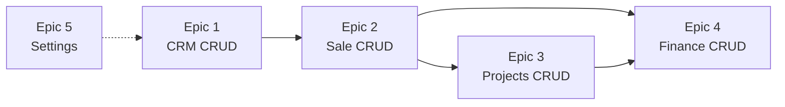

# Epics — VTN-ERP Phase 1

---

## Epic 1: CRM CRUD Hoàn thiện

> **Goal**: PM/Sales quản lý leads đầy đủ lifecycle
> **Depends on**: —

| Story | Description | AC |
|---|---|---|
| E1-S1 | Tạo lead mới | Form modal, validate, persist, refresh Kanban |
| E1-S2 | Sửa lead | Inline edit trên detail page, save to DB |
| E1-S3 | Xóa lead | Confirm dialog, soft delete?, refresh list |
| E1-S4 | Kéo lead sang stage | Drag-drop Kanban, update stageId + probability |
| E1-S5 | Lead → Báo giá | Button trên detail, pre-fill SO from lead data |

**Server Actions cần thêm**: `createLead`, `updateLead`, `deleteLead`, `moveLeadStage`, `convertLeadToOrder`

---

## Epic 2: Sale CRUD Hoàn thiện

> **Goal**: PM quản lý báo giá/hợp đồng đầy đủ lifecycle
> **Depends on**: Epic 1 (Lead → SO flow)

| Story | Description | AC |
|---|---|---|
| E2-S1 | Sửa Sale Order | Edit form, thêm/xóa lines, recalc total |
| E2-S2 | State transitions | DRAFT→SENT→SALE flow, confirm dialog |
| E2-S3 | Sửa/xóa Milestones | Inline edit milestones, save |
| E2-S4 | Sale → Project | Button "Tạo dự án", auto-fill from SO |

**Server Actions cần thêm**: `updateOrder`, `deleteOrder`, `updateOrderState`, `updateOrderLines`, `convertOrderToProject`

---

## Epic 3: Projects CRUD Hoàn thiện

> **Goal**: PM quản lý dự án, phases, tasks
> **Depends on**: Epic 2 (SO → Project flow)

| Story | Description | AC |
|---|---|---|
| E3-S1 | CRUD Phases | Thêm/sửa/xóa phases, reorder sequence |
| E3-S2 | CRUD Tasks | Thêm tasks trong phase, assign user, set priority |
| E3-S3 | Update task state | Move task: TODO→IN_PROGRESS→REVIEW→DONE |
| E3-S4 | Update project state | DRAFT→ACTIVE→PAUSED→DONE flow |

**Server Actions cần thêm**: `createPhase`, `updatePhase`, `deletePhase`, `createTask`, `updateTask`, `deleteTask`, `updateProjectState`

---

## Epic 4: Finance CRUD

> **Goal**: Kế toán tạo invoice, ghi nhận thanh toán
> **Depends on**: Epic 2 (milestones), Epic 3 (projects)

| Story | Description | AC |
|---|---|---|
| E4-S1 | Tạo Invoice | Từ milestone hoặc project, fill data |
| E4-S2 | Invoice state | DRAFT→POSTED→PAID flow |
| E4-S3 | Ghi nhận Payment | Form payment cho invoice, update state |
| E4-S4 | Payment list | Hiện payments trên invoice detail |

**Server Actions cần thêm**: `createInvoice`, `updateInvoice`, `updateInvoiceState`, `createPayment`

---

## Epic 5: Settings & System

> **Goal**: Admin cấu hình công ty, quản lý users
> **Depends on**: —

| Story | Description | AC |
|---|---|---|
| E5-S1 | Persist settings | Lưu tên công ty, email, SĐT, địa chỉ |
| E5-S2 | Toast notifications | Feedback sau mọi CRUD action |
| E5-S3 | Global search | Tìm kiếm across modules |

---

## Dependency Graph



---

## Execution Order

```
Sprint 1: E1 (CRM) → ~5 stories, ~5 actions
Sprint 2: E2 (Sale) → ~4 stories, ~5 actions
Sprint 3: E3 (Projects) → ~4 stories, ~7 actions
Sprint 4: E4 (Finance) → ~4 stories, ~4 actions
Sprint 5: E5 (Settings + UX) → ~3 stories
```
