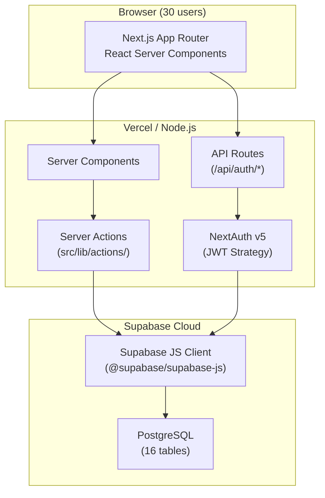
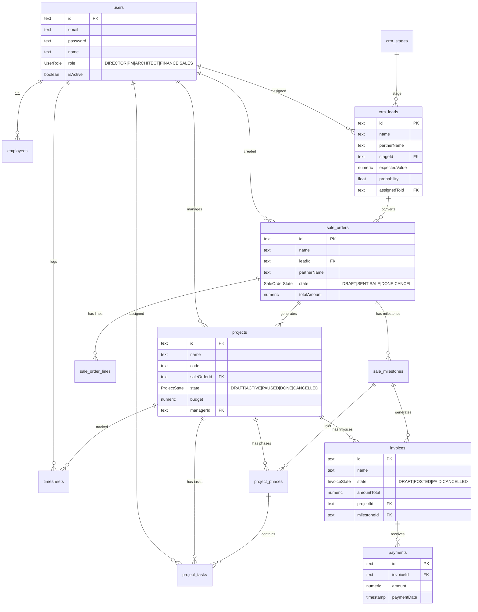

# SDD — VTN-ERP System Design Document

> Phase 1: Hoàn thiện CRUD | Next.js 16 + Supabase

---

## 1. System Architecture



---

## 2. Tech Stack

| Layer | Technology | Version |
|---|---|---|
| Framework | Next.js (Turbopack) | 16.1.6 |
| Auth | NextAuth.js | v5 |
| Database | Supabase PostgreSQL | — |
| Client | @supabase/supabase-js | ^2.x |
| Styling | Vanilla CSS | — |
| Language | TypeScript | 5.x |

---

## 3. Entity Relationship Diagram



---

## 4. Module Map

```
src/
├── app/
│   ├── (dashboard)/
│   │   ├── dashboard/        ← KPIs + recent items
│   │   ├── crm/              ← Kanban + [id] detail
│   │   ├── sale/             ← List + [id] detail + /new form
│   │   ├── projects/         ← List + [id] detail
│   │   ├── employees/        ← Grid view
│   │   ├── finance/invoices/ ← Invoice list
│   │   ├── timesheets/       ← Weekly view
│   │   ├── reports/          ← Charts
│   │   └── settings/         ← Company settings
│   ├── api/auth/             ← signin route
│   └── login/                ← Login page
├── lib/
│   ├── auth.ts               ← NextAuth config (Supabase)
│   ├── supabase.ts           ← Supabase client
│   ├── utils.ts              ← formatCurrency, formatDate
│   └── actions/
│       ├── crm.ts            ← getLeads, getLead
│       ├── sale.ts           ← getOrders, getOrder, createOrder
│       ├── projects.ts       ← getProjects, getProject
│       ├── employees.ts      ← getEmployees
│       ├── finance.ts        ← getInvoices
│       ├── timesheets.ts     ← getTimesheets
│       └── dashboard.ts      ← getDashboardKPIs
```

---

## 5. Server Actions — CRUD Gap Analysis

| Module | Read | Create | Update | Delete |
|---|---|---|---|---|
| CRM Leads | ✅ | ❌ | ❌ | ❌ |
| CRM Stages | ✅ | — | ❌ move | — |
| Sale Orders | ✅ | ✅ | ❌ | ❌ |
| Sale Lines | ✅ | — | ❌ | ❌ |
| Sale Milestones | ✅ | ✅ | ❌ | ❌ |
| Projects | ✅ | ❌ | ❌ | ❌ |
| Project Phases | ✅ | ❌ | ❌ | ❌ |
| Project Tasks | — | ❌ | ❌ | ❌ |
| Invoices | ✅ | ❌ | ❌ | ❌ |
| Payments | — | ❌ | — | — |
| Employees | ✅ | ❌ | ❌ | ❌ |
| Timesheets | ✅ | ❌ | ❌ | ❌ |
| Settings | — | — | ❌ | — |

> **72 actions cần thêm** (Create + Update + Delete cho mỗi entity)

---

## 6. Enums Reference

| Enum | Values |
|---|---|
| UserRole | DIRECTOR, PROJECT_MANAGER, ARCHITECT, FINANCE, SALES |
| SaleOrderState | DRAFT, SENT, SALE, DONE, CANCEL |
| ProjectState | DRAFT, ACTIVE, PAUSED, DONE, CANCELLED |
| PhaseState | TODO, IN_PROGRESS, DONE |
| TaskState | TODO, IN_PROGRESS, REVIEW, DONE |
| Priority | LOW, NORMAL, HIGH, URGENT |
| InvoiceState | DRAFT, POSTED, PAID, CANCELLED |
| InvoiceType | OUT_INVOICE, OUT_REFUND |
| MilestoneState | PENDING, INVOICED, PAID |
